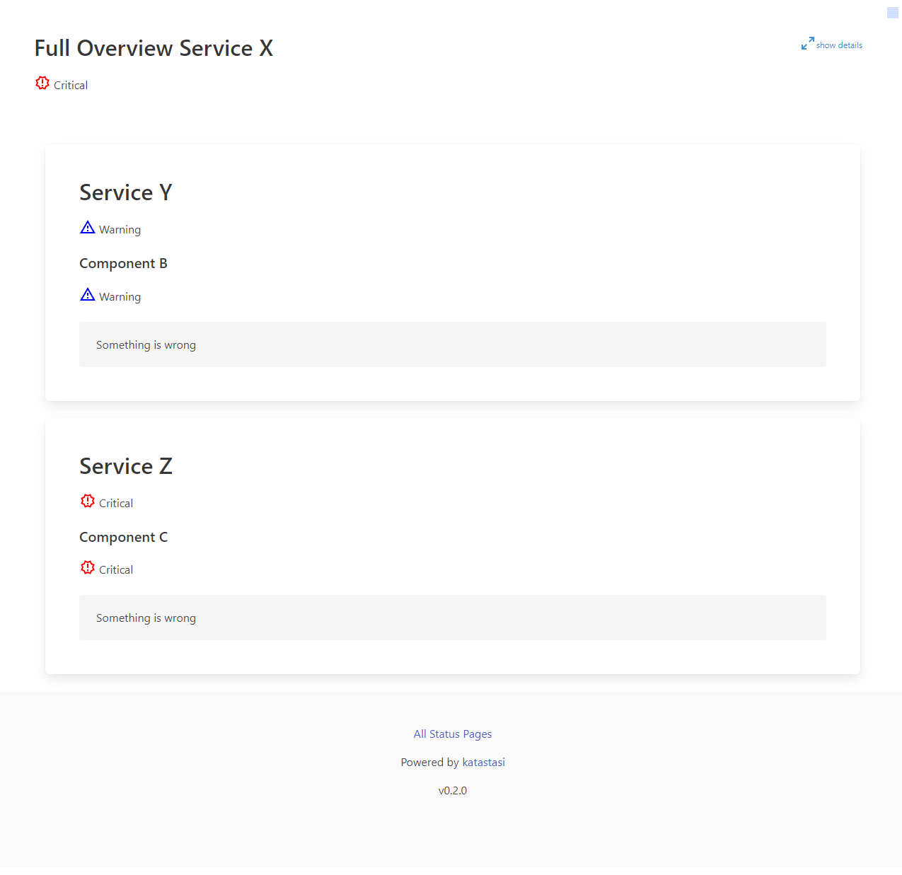

# katastasi

is a simple page that reads config maps from a kubernetes cluster and builds out configured status pages from that config

## screenhots
this is how it looks like
### Start Page


### Sample Status Page


## Status Page Constellation
A service can be used in multiple status pages.
the service defines the metrics that it wants to be checked on the configured prometheus instances
if a service is not configured in a status page, it will not be checked
additionaly one can add maintanance windows to a service, so that it will not be reported as down during that time
````mermaid
    graph RL
    sx[service x] --> sa[status a]
    sy[service y] --> sb[status b]
    sy --> sa
````


# Config File
Katastasi automatically reads the configuration from the following directories: `.` & `/etc/katastasi` the file has to be named `config.yml` The configuration is divided into different sections. 

The following sections are available:

- `prometheus`: This section contains the URL to your Prometheus instance which is necessary for fetching monitoring data. (To change you will have to restart the application.)

```YAML
prometheus:
  url: '<Your_Prometheus_URL>'
```

- `cache`: This section allows you to set the time-to-live (TTL) for cache data. Here, the TTL is set to 12 seconds. (To change you will have to restart the application.)

```YAML
cache:
  ttl: <Cache_TTL>
```


- `queries`: This section holds the different query templates used in the application. You can configure your own query templates based on your monitoring requirements.

```YAML
queries: 
  <Query_Name>: '<Your_Prometheus_Query>' # the query has to be a valid prometheus query and can contain placeholders
```

- `pages`: Pages are specific views in your monitoring dashboard. Each page has a set of services which are queried and displayed.

```YAML
pages:
  - id: <ID> # the id of the page (has to be unique per environment)
    name: <Name> # the name of the page 
    environment: <Environment> # this is used to group the pages
    services:
      - <Service_IDs> # the ids of the services that should be displayed on the page (they are automatically filtered by the environment)
```


- `services`: Services are specific applications or microservices in your environment that are monitored. Each service can have a different query, URL, and alert contact point.

```YAML
services:
  - id: <ID> # the id of the service (has to be unique per environment)
    name: <Name> # the name of the service
    owner: <Owner>
    contact: <Contact_URL>
    url: <Service_URL>
    environment: <Environment> # this is used to filter the services on the status page
    namespace: <Namespace> # this is added to the query as parameter
    components:
      - name: <Component_Name> # the name of the component
        query: <Query_to_be_run> # the query that is specified in the queries section
        description: <Description> # a description that will be displayed on the status page
        conditions: # if no conditions are matching the service will be marked as healthy
         - severity: <Severity_Level> # available are critical, warning, info
           condition: <Compare_Operator> # available are gt, lt, eq, ne, ge, le
           threshold: <Threshold> # the threshold that is used for the comparison
           duration: <Duration> # the duration for which the condition has to be true 
```

- `autoload`: This part controls the ability of the application to fetch the configuration for pages and services from Kubernetes ConfigMaps. The `in_cluster` flag indicates whether or not the application is running inside the Kubernetes cluster. You can find a sample configuration in the [example](./sample/config-config.yml) directory.

```YAML
autoload:
  active: <Active or Not> # default is true
  kubernetes:
    in_cluster: <In Cluster or Not> # default is true
    kubeconfig: <Kubeconfig Path> # Only required if in_cluster is false
  namespaces:
    pages:
      - <Namespaces>
    services:
      - <Namespaces>
```

Please ensure to replace the placeholder values with your actual configuration values. You can find an example here: [config.yml](./config.yaml)

## Deployment
Typically you would like to deploy katastasi in your kubernetes cluster. You can find a sample deployment in the [sample](./sample) directory.